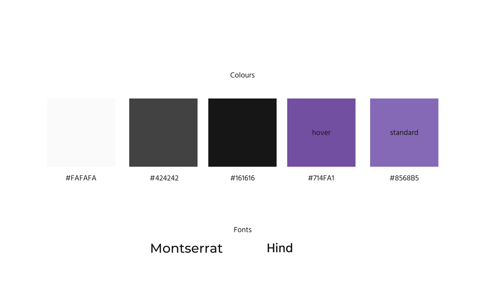
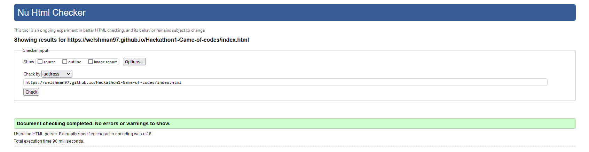
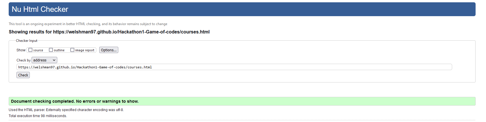
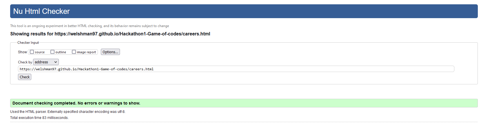
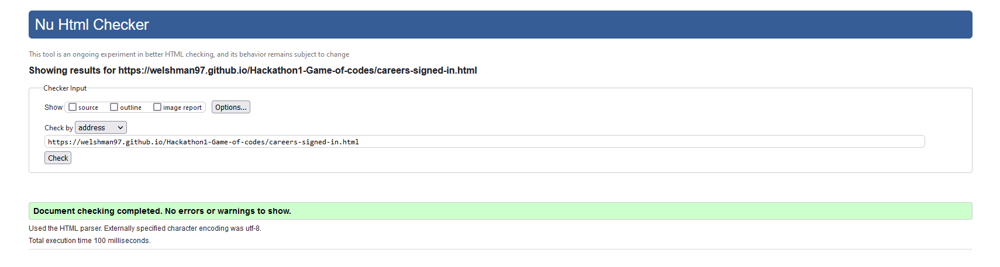
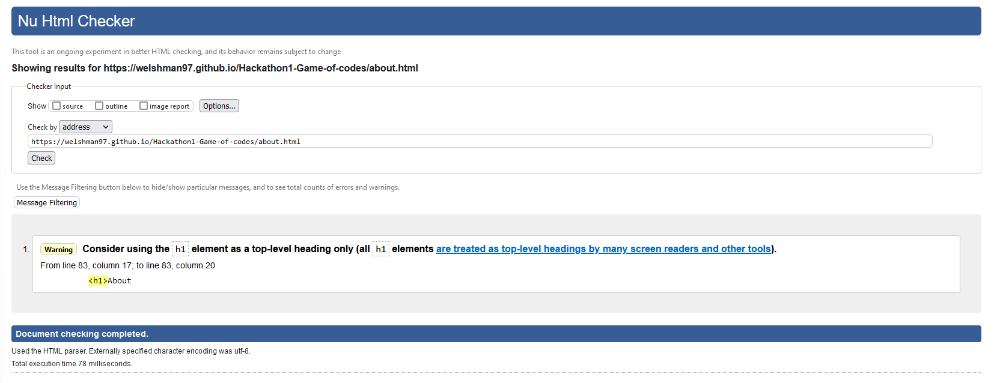
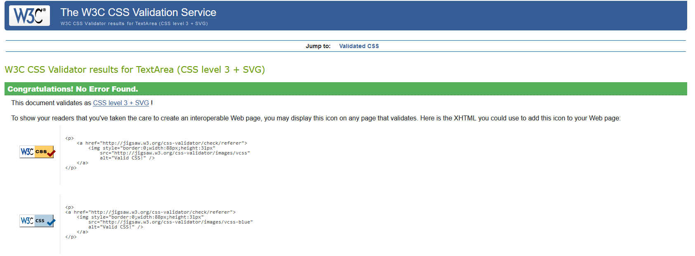

# Coding Federation

The Coding Federation is a website that aims to bring people wishing to become software developers together to learn to code in a self-paced but structured manner from industry professionals, and create a strong community-driven support network for learners. We aim to do this by providing comprehensive, self-paced coding education lead by industry professionals to help guide learners on their journey. We also build and provide community amongst our cohorts and give access to these community to our learners. We also bolster this with robust careers guidance from the start to help with CV writing, LinkedIn profiles, interview practices and live hackathons to simulate real working environments.

# Wireframing
In order to reflect our professional and well-structured ethos we decided to design a site that follows the same theme. In order to show this, we want a simple colour palette which on contains one accent colour. This accent colour will guide our user to the important features on each page. Ensuring an intuitive and simple user experience.

## Mobile

## Desktop

## State changes

## Colour palette & Fonts

# Features
The website uses a combination of diverse features to achieve these goals, from carousels filled with inviting call to actions, contact forms and responsive navigation bars. 

## Existing Features
Features currently implemented.

### Navigation Bar
The navigation bar is available on all pages and allows access to all pages available on the website from any page within the site. This includes the home, courses, careers, and about pages. The logo links back to the homepage as is expected by most users. It makes navigating the entire website easy and intuitive for all users being fully responsive on all screensizes using mobile first design that makes sense to all types of users.

### Landing Page Carousel
The landing page has an eye catching carousel that takes up most of the viewport on various screen sizes. The carousel showcases three of our main features that makes learning with us unique and gives quick access links to those pages for the user to find out more information on each part.

### Sign Up/ Sign In Modal
This modal allows a user to sign up or sign in to our website. Once signed in, a different version of the careers page will show, which has a contact form.

### Events Card
The events card will show upcoming events available that we are offering to people who have signed up to our courses.

## Features Planned For Implementation
Change footer links to icons in mobile.
Further edits to carousel captions to improve responsiveness and layout.
Funding options section to courses page.
Hover states added to buttons and links.
FAQ section in about section.

## Testing
Throughout the creation of the we have been mindful of our sites's responsivesness and accessability as well as being in good, functioning order. 
In order to ensure this, we have conducted rigorous testing throughout the creation process in order to ensure the behaviours of the site are correct. 
Below are a few interesting bugs that we came across while creating this site. 

### Footer
The footer cause us some issues when it came to alignment within the columns. 
In our to fix this, we split the footer sections into their individual divs and used finer controls for the breakpoints. 
The font size and spacing would be an issue to revisit in the future. 

### Carousel
We wanted to create a site which contained a carousel that had a caption section with a white background. Each slide would contain a new image and caption section to showcase our best products for our users. 
However, when it came to building the carousel the width would behave as we thought. After experienceing issues with overflow, we decided to make add finer control to the caption box with flexbox and width contstraints. 

### Review section alignment
Sometimes the best solution to a problem is to take a break and start again. This was exactly the case with index.html's review section. After a short break the solution was clear - by restructuring the quote section, finer control was achieved for the alignment. 

## W3S Validation

### Home Page

### Courses Page

### Careers Page

### Careers Page signed in

### About Page

### CSS Validation

## Deployment
In order to deploy our site and ensure its functionality we used GitHub pages. 

Deployment steps: 
- Navigate to setting section.
- Open pages tab.
- Select "deploy from a branch"
- Select "main" branch and /root
- Click save and wait a moment.

Deploying as early as possible in the creation process is a great way to ensure that your website is working as intended. It will help you squash any bugs early on.

# Credits

## Content

Images - https://www.pexels.com/

Fonts - https://fonts.google.com/

Bootstrap 5.3 - https://getbootstrap.com/

Code Snippets - https://codeinstitute.net/

Icons - https://fontawesome.com/